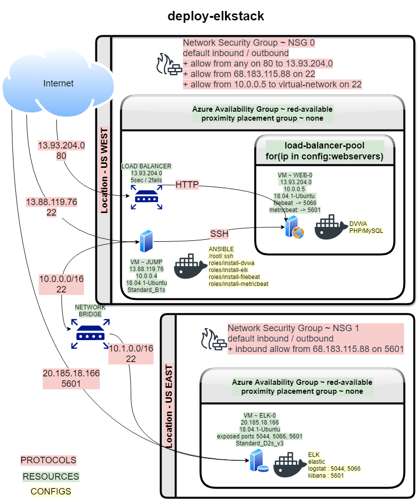
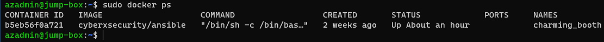

## Automated ELK Stack Deployment

The files in this repository were used to configure the network depicted below.

These files have been tested and used to generate a live ELK deployment on Azure. They can be used to either recreate the entire deployment pictured above. Alternatively, select portions of the _____ file may be used to install only certain pieces of it, such as Filebeat.

  - [hosts](./hosts)
  - [ansible.cfg](./ansible.cfg)
  - [roles/install-dvwa/tasks/main.yml](./Ansible/roles/install-dvwa/tasks/main.yml)
  - [roles/install-filebeat/tasks/main.yml](./roles/install-filebeat/tasks/main.yml)
  - [roles/install-metricbeat/files/metricbeat-config.yml](./roles/install-metricbeat/files/metricbeat-config.yml)
  - [roles/install-elk/tasks/main.yml](./roles/install-elk/tasks/main.yml)

This document contains the following details:
- Description of the Topology
- Access Policies
- ELK Configuration
  - Beats in Use
  - Machines Being Monitored
- How to Use the Ansible Build

### Description of the Topology

The main purpose of this network is to expose a load-balanced and monitored instance of DVWA, the D*mn Vulnerable Web Application.

Load balancing ensures that the application will be highly available, in addition to restricting access to the network.
- The loadbalancer will share the load between multiple servers helping ensure availability
- The jumpbox allows for automated deployment of the servers used in the pool which reduces errors and speeds configuration change deployment.

Integrating an ELK server allows users to easily monitor the vulnerable VMs for changes to the files and system activity.
- Filebeat monitors service logs for elasticsearch, haproxy, kafka, kibana, nats, osquery, santa.
- Metricbeat monitors system and elasticsearch activity.

The configuration details of each machine may be found below.
| Name   | Function    | Public IPv4   | Internal IPv4 | Operating System |
| ------ | ----------- | ------------- | ------------- | ---------------- |
| Jump-0 | Gateway     | 13.88.119.76  | 10.0.0.4      | 18.04.1-Ubuntu   |
| Web-0  | Web Server  | 13.93.204.0   | 10.0.0.5      | 18.04.1-Ubuntu   |
| Web-1  | Web Server  | 13.93.204.0   | 10.0.0.8      | 18.04.1-Ubuntu   |
| ELK-0  | SIEM Server | 20.185.18.166 | 10.1.0.5      | 18.04.1-Ubuntu   |

### Access Policies

The VMs on this network expose 3 ports to the public network. 22, 80 and 5601.

Only the Jump-0 machine can accept SSH connections from the Internet. Access to this machine is only allowed from the following IP addresses:
- 68.183.115.88

Machines within the network can only be accessed using ssh from the ansible docker container on Jump-0.

A summary of the access policies in place can be found in the table below.

| Name            | Publicly Accessible | Allowed IP Addresses |
| --------------- | ------------------- | -------------------- |
| Jump-0 port 22  | Yes                 | 68.183.115.88        |
| Web-* port 22   | No                  | 10.0.0.4 (Jump-0)    |
| Web-*  port 80  | Yes                 | *                    |
| ELK-0 port 22   | No                  | 10.0.0.4 (Jump-0)    |
| ELK-0 port 5601 | Yes                 | 68.183.115.88        |

### Elk Configuration

Ansible was used to automate configuration of the ELK machine. No configuration was performed manually, which is advantageous because...
- it's configuration and deployment will be quick and consistant 

The playbook implements the following tasks:
- Install docker components and tools
- download and launch a docker elk container
- enable docker service start on boot

The following screenshot displays the result of running `docker ps` after successfully configuring the ELK instance.

### Target Machines & Beats
This ELK server is configured to monitor the following machines:
- 10.0.0.5
- 10.0.0.8

We have installed the following Beats on these machines:
- filebeat
- metricbeat

These Beats allow us to collect the following information from each machine:
- Filebeat monitors for changes made to log files by services such as docker, elasticsearch, logbeat, metricbeat and kibana. Metricbeat monitors elasticsearch activity.

### Using the Playbook
In order to use the playbook, you will need to have an Ansible control node already configured, as well as 3 VMs to be used as 2 web servers and an ELK server. 

Assuming you have an Ansible control node completely provisioned 
Assuming you have 3 VMs provisioned (web-0,web-1,elk-0) with ssh configured to allow the Ansible control node ssh access:

SSH into the control node and follow the steps below:
- Copy the [ansible.tar](Images/ansible.tar) file to /etc/ansible in your control node.
- Update the hosts file to include the IPv4 address for 
  - [webservers] web-0, web-1 
  - [elk] elk-0
- Run the dvwa playbook
  - run `sudo roles/ansible-playbook roles/install-dvwa/tasks/main.yml`
  - navigate to `http://<web-0-ip>:80/setup.php` to check the installation worked.
- Run the elk playbook
  - run `sudo roles/ansible-playbook roles/install-elk/tasks/main.yml`
  - navigate to `http://<elk-0-ip>:5601` to check the installation worked.
- Run the filebeat playbook
  - run `sudo roles/ansible-playbook roles/install-filebeat/tasks/main.yml`
  - navigate to Kibana > Discover > select [filebeat-*]  to confirm the installation worked.
- Run the metricbeat playbook
  - run `sudo roles/ansible-playbook roles/install-metricbeat/tasks/main.yml`
  - navigate to Kibana > Discover > select [metricbeat-*]  to confirm the installation worked.
